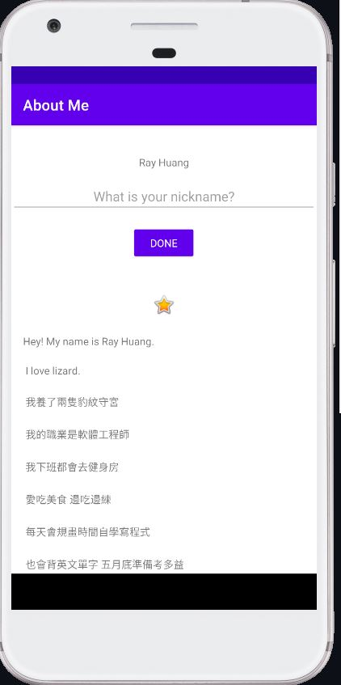
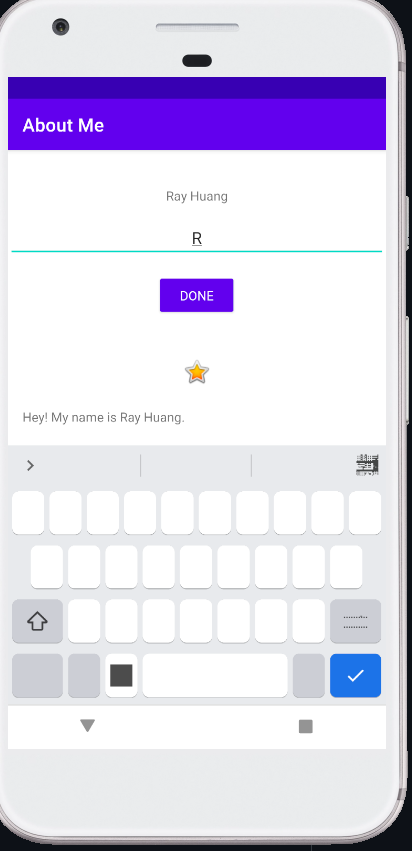
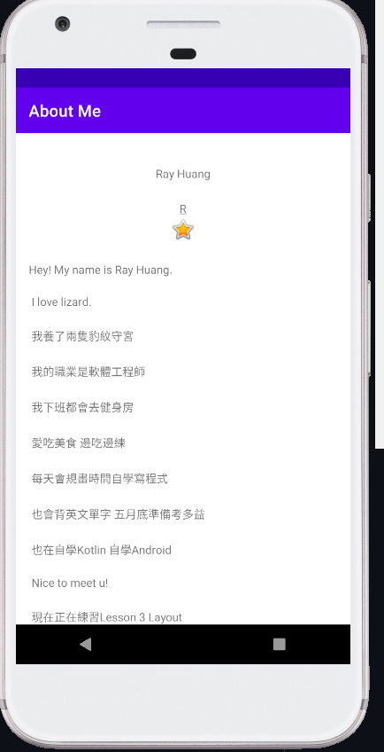

# Layouts - AboutMe app

實作練習 這是udacity android lesson 2 實作練習

## AboutMe

The AboutMe app is a demo app that shows information about a person. 
* Name
* Settable Nickname
* An image
* Scrollable information

This app demonstrates the following views and techniques:
* LinearLayout
* TextView
* EditText
* ImageView
* ScrollView
* Setting multiple click handlers programmatically
* Using data binding for views to improve perforkance and eliminate findViewById

## Screenshots

